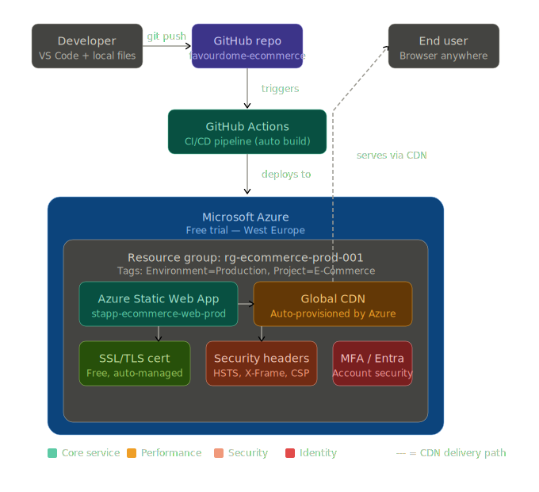

# Favourdome E-Commerce Store

### Azure Cloud Deployment — Portfolio Project

[](https://witty-ocean-089724a03.2.azurestaticapps.net)
[](https://github.com/agbaike/favourdome-ecommerce-website/actions)
[](https://witty-ocean-089724a03.2.azurestaticapps.net)
[](https://azure.microsoft.com/free)

**Live Site:** [https://witty-ocean-089724a03.2.azurestaticapps.net](https://witty-ocean-089724a03.2.azurestaticapps.net)

---

## About This Project

Favourdome is an e-commerce website for mobile phones and accessories. The front-end was built using HTML, CSS, and JavaScript, then deployed to Microsoft Azure with a full CI/CD pipeline, security configuration, and cloud monitoring in place.

This project was built as part of a cloud engineering portfolio to demonstrate hands-on experience with Microsoft Azure, DevOps pipelines, and production-grade web deployment practices.

This README documents the deployment architecture, the decisions made along the way, and why each component is there.

---

## What the Website Does

- Browse smartphones on the Home and Shop pages
- Add products to a cart that persists across browser sessions using localStorage
- Complete a checkout with billing details and payment options
- Receive an order confirmation with a full order summary
- Read product news on the Blog page
- Submit enquiries through the Contact page

---

## Architecture Diagram



Code pushed to GitHub automatically triggers a GitHub Actions pipeline. That pipeline deploys the updated files to Azure Static Web Apps, which serves them through a global CDN. The end user gets the site delivered fast from wherever they are, over HTTPS with security headers applied at the platform level.

---

## How It Was Set Up — Phase by Phase

### Phase 1 — Account Security and Governance

Before creating any resources, the Azure account was secured by enabling Multi-Factor Authentication through Microsoft Entra ID. This adds a second layer of login protection beyond just a password — any sign-in attempt also requires approval on a trusted device.

A Resource Group called `rg-ecommerce-prod-001` was created in the West Europe region, chosen because the project is based in Berlin and lower latency matters for local users. A Resource Group acts as a logical container that keeps all the project's cloud resources organised in one place.

Resource Tags were also applied to the group:

- `Environment: Production`
- `Project: E-Commerce`

Tags might look like a small detail, but in any environment where you need to track what each resource is for, who owns it, and what it costs — they become essential. Getting this right from the beginning rather than retrofitting it later is good practice.

---

### Phase 2 — Source Control and Automated Deployment

The project was pushed to a GitHub repository and connected to Azure Static Web Apps. Azure automatically created a GitHub Actions workflow file in the repository — this is the CI/CD pipeline that handles deployment.

Every push to the `main` branch triggers the pipeline automatically. It picks up the updated files and deploys them to Azure without any manual steps. Deployment typically completes within about 60 seconds.

Authentication between GitHub and Azure is handled by a secret token stored in GitHub's secrets vault as `AZURE_STATIC_WEB_APPS_API_TOKEN`. This keeps the credential out of the codebase entirely — the workflow references it by name, but the actual value is never exposed anywhere in the repository.

---

### Phase 3 — Hosting and Infrastructure

Azure Static Web Apps (Free tier) was chosen as the hosting service. It's well suited to this project because the site runs entirely in the browser — no server-side logic, no database calls, nothing that requires a backend. Static Web Apps handles this kind of deployment cleanly and at no cost.

Two things were provisioned automatically with the service:

**Global CDN** — Azure provisions a Content Delivery Network as part of the Static Web Apps service. Copies of the site are cached at edge locations around the world, so a visitor in Singapore gets served from a nearby node rather than reaching all the way back to West Europe. Pages load faster regardless of where the user is.

**SSL/TLS Certificate** — Issued and managed automatically by Azure. The site runs on HTTPS and the certificate renews without any manual action. This encrypts the connection between the browser and the server, which matters especially on the checkout pages where users enter personal information.

---

### Phase 4 — Security Configuration

A `staticwebapp.config.json` file was added to the project root to configure security headers and routing rules at the platform level. These headers are instructions sent to the browser alongside every page response, telling it how to handle the site securely.

Here is what was configured and why:

**`Strict-Transport-Security`**
Forces the browser to always use HTTPS for this domain, even if someone attempts to access it over HTTP. This blocks protocol downgrade attacks where a connection could be intercepted before it becomes encrypted.

**`X-Content-Type-Options: nosniff`**
Stops the browser from trying to interpret a file as a different type than what the server declares. Without this, a malicious file could disguise itself as something harmless. This header removes that possibility.

**`X-Frame-Options: SAMEORIGIN`**
Prevents the site from being embedded inside an iframe on another domain. This closes off clickjacking attacks, where an attacker layers an invisible version of a site over their own page to trick users into interacting with it unknowingly.

**`Referrer-Policy: strict-origin-when-cross-origin`**
Controls how much information is shared with external sites when a user follows a link away. Internal URL paths stay private.

**`Permissions-Policy`**
Explicitly blocks access to the device camera, microphone, and geolocation. None of these are needed by the site, so there is no reason to leave them accessible.

The config file also handles 404 routing — unknown URLs fall back to `index.html` rather than showing a broken error page.

---

### Phase 5 — Monitoring

The Azure Application Insights SDK was added to all eight HTML pages. This sends telemetry data to Azure — page views, load times, and any JavaScript errors — making it possible to monitor the site's health directly from the Azure portal.

Azure Activity Logs are enabled by default on the resource group. Every infrastructure action is recorded: when resources were created, when deployments ran, and any configuration changes. This is useful for auditing and debugging if anything unexpected happens.

---

## Project Structure

```
favourdome-ecommerce-website/
│
├── .github/
│   └── workflows/
│       └── azure-static-web-apps.yml    ← CI/CD pipeline
│
├── images/                              ← All site images
│
├── index.html                           ← Home page
├── shop.html                            ← Product listings
├── cart.html                            ← Shopping cart
├── checkout.html                        ← Order form
├── order-confirmation.html              ← Post-purchase page
├── about.html                           ← About page
├── contact.html                         ← Contact form
├── blog.html                            ← Blog
│
├── style.css                            ← All styling
├── script.js                            ← Navigation and cart interactions
├── cart.js                              ← Cart logic (localStorage)
├── checkout.js                          ← Form handling and validation
├── order-confirmation.js                ← Order summary
├── products-data.js                     ← Product catalogue
├── form-handler.js                      ← Contact and newsletter forms
│
└── staticwebapp.config.json             ← Azure routing and security headers
```

---

## Technologies Used

| Technology                 | Purpose                             |
| -------------------------- | ----------------------------------- |
| HTML5, CSS3, JavaScript    | Website front-end                   |
| Browser localStorage       | Cart persistence without a database |
| Microsoft Azure            | Cloud platform                      |
| Azure Static Web Apps      | Hosting (free tier)                 |
| Azure CDN                  | Global content delivery             |
| Microsoft Entra ID / MFA   | Identity and account security       |
| GitHub                     | Version control                     |
| GitHub Actions             | Automated CI/CD pipeline            |
| Azure Application Insights | Monitoring and telemetry            |

---

## Key Decisions

**Azure Static Web Apps over a VM or App Service**
The site is entirely static — HTML, CSS, and JavaScript with no server-side processing. Static Web Apps is the right fit for that. A virtual machine or App Service would add unnecessary cost and operational overhead for something that doesn't need a running server.

**West Europe as the deployment region**
Berlin is the primary location for development and the target audience. Keeping the infrastructure in the same region reduces latency and keeps the setup straightforward.

**GitHub secrets for the API token**
Hardcoding credentials in a workflow file is a common mistake that can expose sensitive information publicly. Storing the token as a GitHub secret means it's available to the pipeline without ever appearing in the code.

**Resource tagging from the start**
Tags were applied before deploying any resources rather than adding them later. In a shared cloud environment, tags are one of the main ways to separate costs and ownership across projects and teams.

---

## Running Locally

```bash
git clone https://github.com/agbaike/favourdome-ecommerce-website.git
cd favourdome-ecommerce-website
npx http-server
```

Then open `http://127.0.0.1:8080` in your browser.

---

## Author

**Favour Agbaikeoghene Iruoghene**
Berlin, Germany

[](https://github.com/agbaike)
